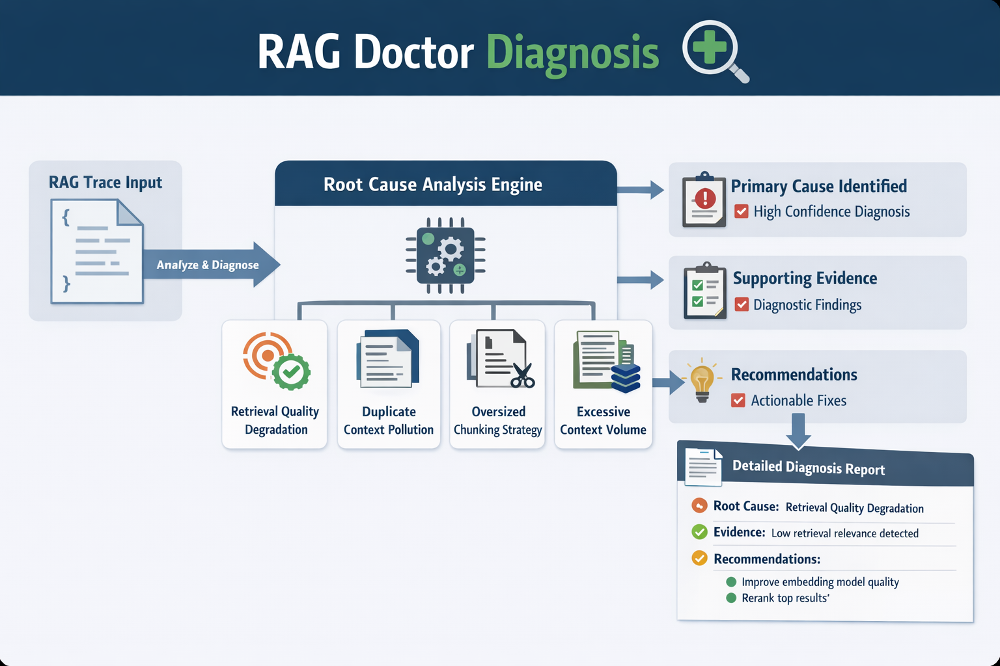

# 🩺 RAG Doctor

> Diagnose and debug your Retrieval Augmented Generation pipelines.



RAG Doctor is an open-source CLI tool and embeddable engine that analyzes RAG execution traces and produces actionable diagnostic findings explaining why a RAG answer might fail.

---

## 🤔 Why RAG Doctor?

RAG pipelines fail in subtle ways:

- 📉 **Low retrieval scores** — the embedding model is misaligned with your domain
- 🔁 **Duplicate chunks** — near-identical text dilutes your context window
- 📦 **Oversized chunks** — individual documents are too long for the model to reason over
- 🌊 **Context overload** — too many retrieved documents bury the relevant signal

RAG Doctor gives you a structured, automated way to detect and fix these issues before they reach production — as a one-shot CLI command, a CI gate, or an embeddable TypeScript library.

---

## 📦 Installation

```bash
# Global install
npm install -g rag-doctor

# Or run without installing
npx rag-doctor analyze trace.json
```

---

## 🚀 Quick Start

```bash
# Analyze a trace file
rag-doctor analyze trace.json

# Output results as JSON (for CI integration)
rag-doctor analyze trace.json --json

# Show help
rag-doctor --help
```

### In 60 seconds

**1. Create a trace file** (`trace.json`):

```json
{
  "query": "How do I reset my password?",
  "retrievedChunks": [
    {
      "id": "chunk-1",
      "text": "To reset your password, go to account settings and click 'Forgot password'.",
      "score": 0.82,
      "source": "help-center.md"
    },
    {
      "id": "chunk-2",
      "text": "Password resets expire after 24 hours. Request a new link if yours has expired.",
      "score": 0.75,
      "source": "faq.md"
    }
  ],
  "finalAnswer": "Go to account settings and click 'Forgot password'.",
  "metadata": { "model": "gpt-4o" }
}
```

**2. Run the analyzer:**

```bash
rag-doctor analyze trace.json
```

**3. Read the report:**

```
──────────────────────────────────────────────────
  RAG Doctor Report
──────────────────────────────────────────────────

  Total findings:  0
  High:            0
  Medium:          0
  Low:             0

──────────────────────────────────────────────────

  ✓ No issues detected
```

A clean bill of health. Now try the included example that triggers findings:

```bash
npx rag-doctor analyze examples/low-score-trace.json
```

---

## 📋 Trace Format

A trace file is a JSON snapshot of a single RAG pipeline execution — the query, the retrieved chunks, the generated answer, and any metadata your system provides.

### Minimal valid trace

```json
{
  "query": "How do I reset my password?",
  "retrievedChunks": []
}
```

### Full trace with all optional fields

```json
{
  "query": "How do I reset my password?",
  "retrievedChunks": [
    {
      "id": "1",
      "text": "To reset your password, go to account settings...",
      "score": 0.82,
      "source": "help-center.md"
    }
  ],
  "finalAnswer": "Go to account settings and click reset password.",
  "metadata": {
    "model": "gpt-4o",
    "timestamp": "2024-01-15T10:23:00Z"
  }
}
```

### Field reference

| Field | Type | Required | Description |
|---|---|---|---|
| `query` | string | ✓ | The original user query — must be non-empty |
| `retrievedChunks` | array | ✓ | Chunks retrieved from the vector store |
| `retrievedChunks[].id` | string | ✓ | Unique chunk identifier — must be non-empty |
| `retrievedChunks[].text` | string | ✓ | Raw text content |
| `retrievedChunks[].score` | number | — | Relevance score (typically 0–1, must be finite) |
| `retrievedChunks[].source` | string | — | Source document reference |
| `finalAnswer` | string | — | The generated LLM answer |
| `metadata` | object | — | Optional metadata (model names, timestamps, etc.) |

> **Tip:** `score` is optional but recommended. Rules like `low-retrieval-score` are skipped entirely if no chunks have scores — there are no false positives on unscored traces.

### How validation works

Every trace goes through the shared `@rag-doctor/ingestion` pipeline before analysis:

1. **Schema validation** — all required fields are present and have the correct types. All issues are collected in a single pass so you see every problem at once.
2. **Normalization** — the validated object is converted into a canonical `NormalizedTrace`: query whitespace is trimmed, optional arrays default to `[]`, and unknown extra fields are silently ignored.

If validation fails, RAG Doctor exits with a structured error:

```
Error: Invalid trace format: Trace validation failed
  • retrievedChunks[1].score: expected number, got string
  • retrievedChunks[2].id: expected non-empty string, got missing
```

In `--json` mode, the error is a machine-readable payload:

```json
{
  "code": "INVALID_TRACE_SCHEMA",
  "message": "Trace validation failed",
  "issues": [
    {
      "path": "retrievedChunks[1].score",
      "expected": "number",
      "received": "string"
    }
  ]
}
```

### Common validation errors

| Error | Cause |
|---|---|
| `query: expected non-empty string, got missing` | The `query` field is absent or null |
| `query: expected non-empty string, got empty string` | The query is whitespace-only |
| `retrievedChunks: expected array, got missing` | The `retrievedChunks` field is absent |
| `retrievedChunks[N].id: expected non-empty string, got missing` | A chunk is missing its `id` |
| `retrievedChunks[N].score: expected number, got string` | A score was provided as a quoted string instead of a number |
| `retrievedChunks[N].score: expected finite number, got Infinity` | A score is `Infinity` or `NaN` |

---

## 📊 Example Output

### Terminal report (default)

```
──────────────────────────────────────────────────
  RAG Doctor Report
──────────────────────────────────────────────────

  Total findings:  2
  High:            1
  Medium:          1
  Low:             0

──────────────────────────────────────────────────

  Findings:

  [HIGH] Average retrieval score is 0.220
  → Check your embedding model alignment with your domain.

  [MEDIUM] Found 1 near-duplicate chunk pair(s).
  → Implement deduplication in your chunking pipeline.
```

### JSON output (`--json`)

```bash
rag-doctor analyze trace.json --json
```

```json
{
  "findings": [
    {
      "ruleId": "low-retrieval-score",
      "ruleName": "Low Retrieval Score",
      "severity": "high",
      "message": "Average retrieval score is 0.220",
      "recommendation": "Check your embedding model alignment with your domain.",
      "details": {
        "averageScore": 0.22,
        "threshold": 0.5,
        "chunksEvaluated": 5,
        "lowestChunks": [...]
      }
    }
  ],
  "summary": {
    "high": 1,
    "medium": 0,
    "low": 0
  }
}
```

> **CI gate:** In terminal mode, the CLI exits with code `1` when any `high`-severity finding is present — making it a natural CI gate. JSON mode always exits `0` so downstream scripts can process results programmatically.

---

## 🔍 Diagnosis

The `diagnose` command goes one step further than `analyze` — it infers the most likely **root cause(s)** of your RAG pipeline's problems and suggests concrete fixes.

```bash
rag-doctor diagnose examples/low-score-trace.json
```

Example output:

```
──────────────────────────────────────────────────
  RAG Doctor Diagnosis
──────────────────────────────────────────────────

Primary root cause:
  [HIGH CONFIDENCE] Retrieval Quality Degradation

  The trace shows weak retrieval relevance signals, suggesting the retriever
  returned low-value context for the query.

──────────────────────────────────────────────────

Evidence:
  [HIGH] Average retrieval score is 0.220

──────────────────────────────────────────────────

Recommendations:
  → Check embedding model quality and ensure it is aligned with your domain
  → Verify retriever relevance by inspecting returned chunk content
  → Consider adding a reranker to promote the most relevant results
```

When multiple rules fire, the most severe finding becomes the **primary cause** and the rest are listed as **contributing causes**. Use `--json` to get machine-readable output for programmatic processing:

```bash
rag-doctor diagnose trace.json --json
```

```json
{
  "primaryCause": {
    "id": "retrieval-quality-degradation",
    "title": "Retrieval Quality Degradation",
    "confidence": "high",
    "summary": "The trace shows weak retrieval relevance signals..."
  },
  "contributingCauses": [],
  "evidence": [
    {
      "findingRuleId": "low-retrieval-score",
      "findingMessage": "Average retrieval score is 0.220",
      "severity": "high"
    }
  ],
  "recommendations": [
    "Check embedding model quality and ensure it is aligned with your domain",
    "Verify retriever relevance by inspecting returned chunk content",
    "Consider adding a reranker to promote the most relevant results"
  ]
}
```

### 🗂️ Root Cause Categories

| Cause ID | Triggered By | Description |
|---|---|---|
| `retrieval-quality-degradation` | `low-retrieval-score` | Retriever returned low-relevance chunks |
| `duplicate-context-pollution` | `duplicate-chunks` | Near-duplicate chunks dilute context quality |
| `oversized-chunking-strategy` | `oversized-chunk` | Chunks are too large, inflating token usage |
| `excessive-context-volume` | `context-overload` | Too many chunks increase noise in the prompt |

---

## 🛡️ Built-in Diagnostic Rules

| Rule ID | Severity | Default Threshold | Description |
|---|---|---|---|
| `low-retrieval-score` | 🔴 high | avg score < 0.5 | Flags traces where chunks have poor relevance scores |
| `duplicate-chunks` | 🟡 medium | Jaccard similarity ≥ 0.8 | Detects near-duplicate retrieved chunks |
| `context-overload` | 🟡 medium | > 10 chunks | Flags traces with too many retrieved documents |
| `oversized-chunk` | 🟢 low | text length > 1200 chars | Flags individual chunks that are too long |

All thresholds are configurable. See [Configuring Rules](#️-configuring-rules) below.

---

## ⚙️ Configuring Rules

RAG Doctor supports configurable rule thresholds and reusable rule packs.

### Built-in packs

| Pack | Description | Key differences from defaults |
|---|---|---|
| `recommended` | All rules with balanced defaults | Same as default behavior |
| `strict` | All rules with tighter thresholds | `similarityThreshold: 0.7`, `averageScoreThreshold: 0.6`, `maxChunkLength: 1000`, `maxChunkCount: 8` |

### Config file

Create a `rag-doctor.config.json` file:

```json
{
  "packs": ["recommended"],
  "ruleOptions": {
    "low-retrieval-score": {
      "averageScoreThreshold": 0.6
    },
    "context-overload": {
      "maxChunkCount": 8
    }
  }
}
```

Pass it to any command with `--config`:

```bash
rag-doctor analyze trace.json --config rag-doctor.config.json
rag-doctor diagnose trace.json --config rag-doctor.config.json
```

### Per-rule configurable options

| Rule ID | Option | Type | Default | Constraint |
|---|---|---|---|---|
| `duplicate-chunks` | `similarityThreshold` | `number` | `0.8` | `> 0` and `<= 1` |
| `low-retrieval-score` | `averageScoreThreshold` | `number` | `0.5` | `>= 0` and `<= 1` |
| `oversized-chunk` | `maxChunkLength` | `integer` | `1200` | positive integer |
| `context-overload` | `maxChunkCount` | `integer` | `10` | positive integer |

### Strict pack example

Use the built-in strict pack for more demanding quality gates:

```bash
# Create rag-doctor.config.json with strict pack
echo '{ "packs": ["strict"] }' > rag-doctor.config.json
rag-doctor analyze trace.json --config rag-doctor.config.json
```

### Programmatic usage with packs

```typescript
import { analyzeTrace } from "@rag-doctor/core";
import { ingestTrace } from "@rag-doctor/ingestion";

const trace = ingestTrace(rawJson);

// Use the strict pack
const result = analyzeTrace(trace, { packs: ["strict"] });

// Use recommended pack with custom overrides
const result2 = analyzeTrace(trace, {
  packs: ["recommended"],
  ruleOptions: {
    "low-retrieval-score": { averageScoreThreshold: 0.6 },
    "context-overload": { maxChunkCount: 8 },
  },
});
```

### Rule factories

Each built-in rule can also be instantiated directly with typed options:

```typescript
import {
  createLowRetrievalScoreRule,
  createContextOverloadRule,
  RuleConfigurationError,
} from "@rag-doctor/rules";

try {
  const strictScoreRule = createLowRetrievalScoreRule({ averageScoreThreshold: 0.7 });
  const tightOverloadRule = createContextOverloadRule({ maxChunkCount: 5 });
  const result = analyzeTrace(trace, { rules: [strictScoreRule, tightOverloadRule] });
} catch (err) {
  if (err instanceof RuleConfigurationError) {
    console.error(`Rule "${err.ruleId}": bad option "${err.optionKey}" — ${err.constraint}`);
  }
}
```

---

## 🌐 Supported Trace Formats

RAG Doctor supports multiple trace formats. The adapter layer auto-detects the format, or you can specify it explicitly with `--format`.

### Canonical

RAG Doctor's native format. Auto-detected when the input has `query` and `retrievedChunks`.

```json
{
  "query": "What is RAG?",
  "retrievedChunks": [{ "id": "c1", "text": "RAG is...", "score": 0.91 }],
  "finalAnswer": "RAG is..."
}
```

### Event-trace

A generic event-based RAG trace. Auto-detected when the input has an `events` array.

```json
{
  "events": [
    { "type": "query.received", "query": "What is RAG?" },
    { "type": "retrieval.completed", "chunks": [
      { "id": "c1", "text": "RAG is...", "score": 0.91, "source": "wiki" }
    ]},
    { "type": "answer.generated", "answer": "RAG combines retrieval with generation." }
  ],
  "metadata": { "pipeline": "custom-rag" }
}
```

### LangChain

A simplified LangChain-style trace. Auto-detected when the input has `input` and `retrieverOutput`.

```json
{
  "input": "How does chunking affect retrieval?",
  "retrieverOutput": [
    { "pageContent": "Smaller chunks improve precision.", "metadata": { "source": "doc-1" }, "score": 0.72 }
  ],
  "output": "Chunking strongly influences quality."
}
```

### LangSmith

A simplified LangSmith-inspired trace. Auto-detected when the input has `run_type`, `inputs`, and `outputs`.

```json
{
  "run_type": "chain",
  "inputs": { "question": "Why do duplicate chunks hurt RAG?" },
  "outputs": { "answer": "Duplicate chunks waste context budget." },
  "retrieval": {
    "documents": [
      { "id": "doc-a", "content": "Duplicates repeat context.", "score": 0.64, "source": "guide" }
    ]
  },
  "extra": { "project": "rag-eval" }
}
```

### CLI usage

```bash
# Auto-detect format (recommended)
rag-doctor analyze trace.json

# Explicit format
rag-doctor analyze langchain-trace.json --format langchain
rag-doctor diagnose langsmith-trace.json --format langsmith

# Combine with other flags
rag-doctor analyze trace.json --format event-trace --json
rag-doctor analyze trace.json --format langchain --config rag-doctor.config.json
```

### Programmatic usage

```typescript
import { adaptTrace, detectTraceFormat } from "@rag-doctor/adapters";
import { ingestTrace } from "@rag-doctor/ingestion";
import { analyzeTrace } from "@rag-doctor/core";

const rawJson = JSON.parse(fs.readFileSync("langchain-trace.json", "utf-8"));

// Auto-detect and adapt
const adapted = adaptTrace(rawJson);
console.log(adapted.format);   // "langchain"
console.log(adapted.warnings); // ["Generated deterministic IDs for 2 chunk(s)..."]

// Ingest and analyze
const trace = ingestTrace(adapted.trace);
const result = analyzeTrace(trace);
```

---

## 🎓 Tutorials

### Tutorial 1: Diagnosing low retrieval scores

Low retrieval scores mean your vector store is returning chunks that aren't very relevant to the query. This is one of the most common RAG failure modes.

**Step 1** — Run the example low-score trace:

```bash
rag-doctor analyze examples/low-score-trace.json
```

You'll see a `[HIGH]` finding with the average score and the three worst-scoring chunks listed in details.

**Step 2** — Get the raw details as JSON to inspect which chunks are the culprits:

```bash
rag-doctor analyze examples/low-score-trace.json --json | jq '.findings[0].details'
```

**Step 3** — Use the chunk IDs from `lowestChunks` to trace back to your vector store and inspect why those documents ranked so low.

**Common fixes:**
- 🔄 Re-embed your documents with a domain-specific embedding model
- 🏷️ Add metadata filters so the retriever only queries relevant subsets
- 📐 Use a reranker (e.g. Cohere Rerank, BGE Reranker) as a second-pass filter

---

### Tutorial 2: Eliminating duplicate chunks

Duplicate chunks waste your context window and can cause the LLM to over-weight certain information.

**Step 1** — Inspect the duplicate-chunks example:

```bash
rag-doctor analyze tests/fixtures/broken-duplicate-trace.json
```

**Step 2** — Check which chunk pairs triggered the rule:

```bash
rag-doctor analyze tests/fixtures/broken-duplicate-trace.json --json | jq '.findings[0].details.pairs'
```

**Step 3** — Implement deduplication at ingestion time using the chunk IDs.

**Common fixes:**
- 🗑️ Deduplicate at index time using hash-based or embedding-based similarity
- 🔧 Add a post-retrieval deduplication step before passing chunks to the LLM
- 📊 Use MMR (Maximal Marginal Relevance) retrieval to promote diversity

---

### Tutorial 3: Using RAG Doctor in CI

Add RAG Doctor as an automated quality gate in your pipeline:

**GitHub Actions:**

```yaml
name: RAG Quality Gate

on: [push, pull_request]

jobs:
  rag-quality:
    runs-on: ubuntu-latest
    steps:
      - uses: actions/checkout@v4

      - name: Install Node.js
        uses: actions/setup-node@v4
        with:
          node-version: 20

      - name: Run RAG Doctor
        run: npx rag-doctor analyze traces/latest-trace.json
        # Exits with code 1 if any HIGH severity finding is detected
```

**Pre-commit hook** (`.git/hooks/pre-commit`):

```bash
#!/bin/sh
if [ -f trace.json ]; then
  npx rag-doctor analyze trace.json
fi
```

> The CLI exits `0` on a clean report and `1` on any `high`-severity finding — no extra configuration needed.

---

### Tutorial 4: Embedding the engine in your application

RAG Doctor's core engine has zero I/O dependencies and can be embedded in any environment — API servers, VS Code extensions, browser apps, or Next.js routes.

```typescript
import { analyzeTrace } from "@rag-doctor/core";
import { normalizeTrace, ParseError } from "@rag-doctor/parser";

// In an Express API route
app.post("/api/analyze", (req, res) => {
  let trace;
  try {
    trace = normalizeTrace(req.body);
  } catch (err) {
    if (err instanceof ParseError) {
      return res.status(400).json({ error: err.message, field: err.field });
    }
    throw err;
  }

  const result = analyzeTrace(trace);

  // Gate on high-severity findings
  const status = result.summary.high > 0 ? 422 : 200;
  return res.status(status).json(result);
});
```

**Install only what you need:**

```bash
# Just the engine (browser-safe, zero dependencies)
npm install @rag-doctor/core @rag-doctor/types

# Add the parser for input validation
npm install @rag-doctor/parser

# Add the terminal reporter for Node.js outputs
npm install @rag-doctor/reporters
```

---

### Tutorial 5: Writing a custom rule

Any object implementing `DiagnosticRule` works as a rule. Here's a complete example:

```typescript
// rules/empty-answer.rule.ts
import type { DiagnosticRule, DiagnosticFinding, NormalizedTrace } from "@rag-doctor/types";

export const EmptyAnswerRule: DiagnosticRule = {
  id: "empty-answer",
  name: "Empty Final Answer",

  run(trace: NormalizedTrace): DiagnosticFinding[] {
    if (trace.finalAnswer && trace.finalAnswer.trim().length > 0) {
      return [];
    }
    return [
      {
        ruleId: this.id,
        ruleName: this.name,
        severity: "high",
        message: "The pipeline produced no final answer.",
        recommendation:
          "Check that your LLM call is completing and that the response is captured correctly.",
        details: {
          hadFinalAnswer: !!trace.finalAnswer,
          query: trace.query,
        },
      },
    ];
  },
};
```

Pass it alongside (or instead of) the built-in rules:

```typescript
import { analyzeTrace } from "@rag-doctor/core";
import { defaultRules } from "@rag-doctor/rules";
import { EmptyAnswerRule } from "./rules/empty-answer.rule.js";

const result = analyzeTrace(trace, {
  rules: [...defaultRules, EmptyAnswerRule],
});
```

**Rule authoring tips:**
- ✅ `run()` must be a **pure function** — same input always produces same output
- ✅ Return an **empty array** (not `null`/`undefined`) when the rule doesn't fire
- ✅ Put machine-readable data in `details` so programmatic consumers don't need to parse `message`
- ✅ Use `recommendation` to suggest a concrete fix, not just describe the problem

---

## 🔌 Programmatic Usage

The core engine has zero CLI dependencies and can be embedded anywhere.

### Using the shared ingestion pipeline (recommended)

```typescript
import { ingestTrace, TraceValidationError } from "@rag-doctor/ingestion";
import { analyzeTrace } from "@rag-doctor/core";
import fs from "fs";

const rawJson = JSON.parse(fs.readFileSync("trace.json", "utf-8"));

try {
  const trace = ingestTrace(rawJson);  // validates + normalizes
  const result = analyzeTrace(trace);
  console.log(result.summary);   // { high: 1, medium: 0, low: 0 }
  console.log(result.findings);  // DiagnosticFinding[]
} catch (err) {
  if (err instanceof TraceValidationError) {
    // Structured, field-level error payload
    console.error(JSON.stringify(err.toPayload(), null, 2));
    // {
    //   "code": "INVALID_TRACE_SCHEMA",
    //   "message": "Trace validation failed",
    //   "issues": [{ "path": "retrievedChunks[0].score", "expected": "number", "received": "string" }]
    // }
  }
}
```

### Using rule packs (Phase 3)

```typescript
import { ingestTrace } from "@rag-doctor/ingestion";
import { analyzeTrace, RuleConfigurationError, UnknownPackError } from "@rag-doctor/core";
import fs from "fs";

const trace = ingestTrace(JSON.parse(fs.readFileSync("trace.json", "utf-8")));

try {
  const result = analyzeTrace(trace, {
    packs: ["strict"],                 // use the strict built-in pack
    ruleOptions: {
      "low-retrieval-score": { averageScoreThreshold: 0.7 },  // override one threshold
    },
  });
  console.log(result.summary);
} catch (err) {
  if (err instanceof UnknownPackError) {
    console.error(`Unknown pack: ${err.packName}`);
  } else if (err instanceof RuleConfigurationError) {
    console.error(`Bad config for rule "${err.ruleId}": ${err.message}`);
  }
}
```

### Using lower-level packages

```typescript
import { analyzeTrace } from "@rag-doctor/core";
import { normalizeTrace } from "@rag-doctor/parser";
import { printTerminalReport } from "@rag-doctor/reporters";
import fs from "fs";

const rawJson = JSON.parse(fs.readFileSync("trace.json", "utf-8"));
const trace = normalizeTrace(rawJson);
const result = analyzeTrace(trace);

// Pretty-print to terminal
printTerminalReport(result);

// Or use structured data directly
console.log(result.summary);     // { high: 1, medium: 0, low: 0 }
console.log(result.findings);    // DiagnosticFinding[]
```

**Capture reporter output (no stdout side effects):**

```typescript
const lines: string[] = [];
printTerminalReport(result, {
  write: (line) => lines.push(line),
});
// lines now contains the full formatted report
```

---

## 🏗️ Monorepo Structure

```
rag-doctor/
├── apps/
│   └── cli/              # 📟 CLI entry point (published as `rag-doctor`)
├── packages/
│   ├── types/            # 📐 Shared TypeScript interfaces
│   ├── adapters/         # 🔌 External trace format adapters (canonical, event-trace, langchain, langsmith)
│   ├── ingestion/        # 🔒 Shared trace ingestion pipeline (validate + normalize)
│   ├── parser/           # 🔍 Trace normalizer & validator (legacy, used by ingestion)
│   ├── rules/            # 📏 Built-in diagnostic rules
│   ├── core/             # ⚙️  Analysis engine (zero I/O dependencies)
│   ├── diagnostics/      # 🧠 Root cause analysis engine
│   └── reporters/        # 🖨️  Terminal and future reporters
├── tests/
│   └── fixtures/         # 🧪 Shared JSON fixtures for tests
├── examples/
│   ├── basic-trace.json
│   ├── low-score-trace.json
│   └── context-overload-trace.json
└── docs/
    ├── ARCHITECTURE.md
    └── CONTRIBUTING.md
```

---

## 🧪 Testing

RAG Doctor has comprehensive test coverage across all packages.

### Running tests

```bash
# Run all tests across the monorepo
pnpm test

# Watch mode (re-runs on file change)
pnpm test:watch

# Run tests for a single package
pnpm --filter @rag-doctor/parser test
pnpm --filter @rag-doctor/rules test
pnpm --filter @rag-doctor/core test
pnpm --filter @rag-doctor/reporters test
pnpm --filter rag-doctor test
```

### Test coverage

| Package | Tests | What's Covered |
|---|---|---|
| `@rag-doctor/adapters` | 69 | Format detection (canonical, event-trace, langchain, langsmith, unknown, priority), each adapter (valid input, missing fields, generated IDs, warnings, errors), integration with ingestion |
| `@rag-doctor/parser` | 50 | Valid traces, optional fields, all `ParseError` paths, chunk-level validation, score edge cases (Infinity, NaN, 0, 1), metadata passthrough |
| `@rag-doctor/rules` | 114 | Each rule: fires / does not fire, threshold boundaries, structured `details` fields, edge cases; rule factories, custom thresholds, `RuleConfigurationError`, packs (`recommended`, `strict`), ruleOptions overrides |
| `@rag-doctor/core` | 43 | Return shape, summary accuracy, custom rule injection, multi-rule aggregation, real rule scenarios; pack resolution, ruleOptions overrides, `UnknownPackError`, backward compatibility |
| `@rag-doctor/ingestion` | 77 | Valid/invalid traces, schema validation, normalization, structured errors |
| `@rag-doctor/reporters` | 52 | Header/structure, zero-findings message, severity labels, sort order, injected `write` |
| `rag-doctor` (CLI) | 141 | Argument parsing, help display, error messages, analyze/diagnose commands, `--json` flag, exit codes, `--config`/`--format` flags, adapter integration, auto-detection, pack resolution, regression |
| **Total** | **525+** | |

### Test fixtures

Fixture JSON files live in `tests/fixtures/`:

| File | Category | Triggers |
|---|---|---|
| `valid-clean-trace.json` | Valid | Nothing — minimal clean trace (2 high-score chunks) |
| `valid-basic-trace.json` | Valid | Nothing — clean full trace with all optional fields |
| `valid-minimal-trace.json` | Valid | Nothing — one chunk, no optional fields |
| `valid-low-score-trace.json` | Valid | `low-retrieval-score` (HIGH) — valid trace with low scores |
| `valid-medium-score-trace.json` | Valid | Nothing under default thresholds; `low-retrieval-score` (HIGH) under strict/tight config |
| `broken-low-score-trace.json` | Valid | `low-retrieval-score` (HIGH) — avg score ≈ 0.22 |
| `broken-duplicate-trace.json` | Valid | `duplicate-chunks` (MEDIUM) — 3 identical chunks |
| `context-overload-trace.json` | Valid | `context-overload` (MEDIUM) — 12 retrieved chunks |
| `oversized-chunk-trace.json` | Valid | `oversized-chunk` (LOW) — one chunk > 1200 chars |
| `multi-rule-trace.json` | Valid | `low-retrieval-score` + `duplicate-chunks` + `context-overload` simultaneously |
| `invalid-json.txt` | Invalid | Parse error — not valid JSON |
| `invalid-schema.json` | Invalid | Schema error — valid JSON but wrong field names |
| `invalid-missing-fields.json` | Invalid | Schema error — missing `query` and `retrievedChunks` |
| `invalid-bad-score-type.json` | Invalid | Schema error — scores provided as strings instead of numbers |
| `invalid-malformed-chunks.json` | Invalid | Schema error — chunks array contains primitives, nulls, nested arrays |
| `config-recommended.json` | Config | `{ "packs": ["recommended"] }` |
| `config-strict.json` | Config | `{ "packs": ["strict"] }` |
| `config-tight-thresholds.json` | Config | `recommended` pack + tight thresholds (triggers on medium-score trace) |
| `config-unknown-pack.json` | Config | Invalid — references nonexistent pack |
| `config-invalid-option.json` | Config | Invalid — `maxChunkCount: 0` (must be positive) |
| `config-invalid-json.json` | Config | Invalid — not valid JSON |
| `config-not-object.json` | Config | Invalid — root value is an array, not an object |
| `config-packs-not-array.json` | Config | Invalid — `packs` is a string instead of an array |
| `event-trace-valid.json` | Adapter | Valid event-trace format (auto-detected) |
| `langchain-valid.json` | Adapter | Valid LangChain format (auto-detected) |
| `langsmith-valid.json` | Adapter | Valid LangSmith format (auto-detected) |
| `unknown-format.json` | Adapter | Invalid — unrecognized format, falls through to ingestion validation |
| `malformed-langchain.json` | Adapter | Invalid — LangChain-shaped but with wrong field types |
| `malformed-event-trace.json` | Adapter | Invalid — event-trace shaped but events is a string |

### CLI test architecture

CLI tests use two complementary layers:

1. **In-process unit tests** (`cli.test.ts`) — inject a `CliIO` interface to capture stdout/stderr and catch exit codes without spawning a subprocess. Fast, runs in milliseconds.
2. **Subprocess integration tests** (`cli.integration.test.ts`) — spawn the compiled `dist/bin.js` binary via `spawnSync`. Verifies real process exit codes, stdout/stderr streams, and shebang execution. Skipped automatically if `dist/bin.js` hasn't been built yet.

---

## 🛠️ Development

### Prerequisites

- Node.js 18+
- pnpm 9+

### Setup

```bash
git clone https://github.com/your-org/rag-doctor.git
cd rag-doctor
pnpm install
pnpm build
```

### Commands

```bash
pnpm build        # Build all packages
pnpm test         # Run all tests
pnpm dev          # Watch mode for all packages
pnpm lint         # Lint all packages
pnpm typecheck    # TypeScript type check
```

### Running the CLI locally

```bash
pnpm build
node apps/cli/dist/bin.js analyze examples/basic-trace.json
node apps/cli/dist/bin.js analyze examples/low-score-trace.json
node apps/cli/dist/bin.js analyze examples/context-overload-trace.json --json
```

---

## 🔮 Future Integrations

RAG Doctor's modular design supports these planned integrations:

| Integration | Description |
|---|---|
| 🧩 **VS Code Extension** | Inline diagnostics while editing trace files in the editor |
| ⚙️ **GitHub Action** | Fail CI when high-severity issues are detected |
| ☁️ **Cloud Dashboard** | Aggregate diagnostics across production traces over time |
| 📣 **Custom Reporters** | Output findings to Slack, PagerDuty, or Datadog |
| 🧠 **LangSmith / LlamaIndex adapters** | Ingest traces from popular RAG frameworks without manual conversion |

---

## 🤝 Contributing

Contributions are welcome! See [docs/CONTRIBUTING.md](docs/CONTRIBUTING.md) for guidelines.

---

## 📄 License

MIT © RAG Doctor Contributors
